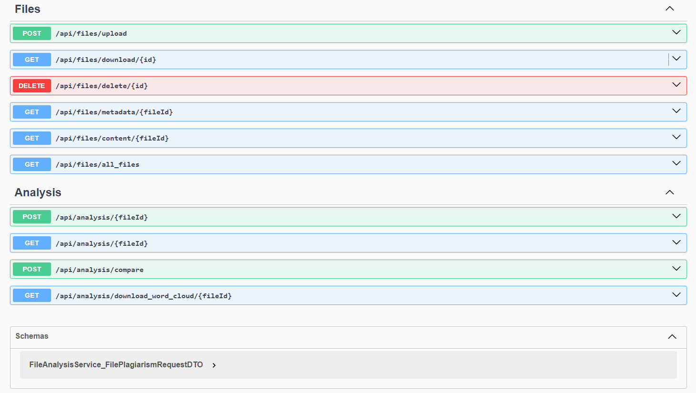
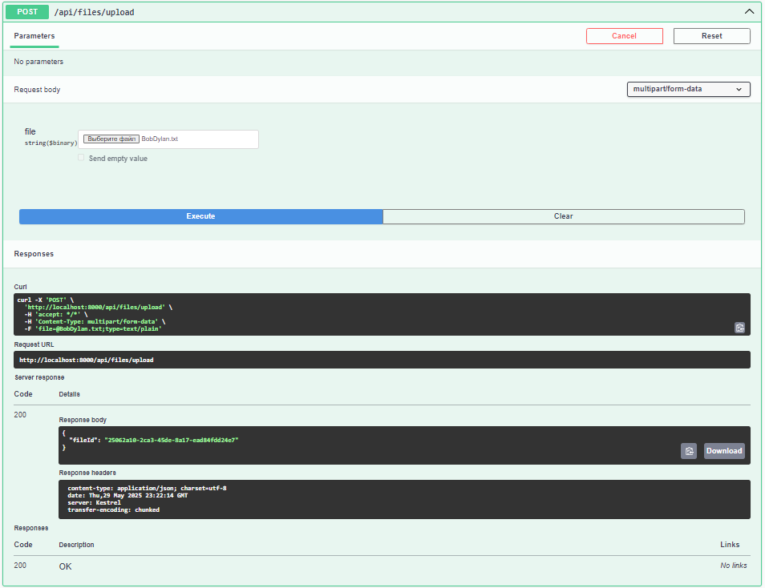
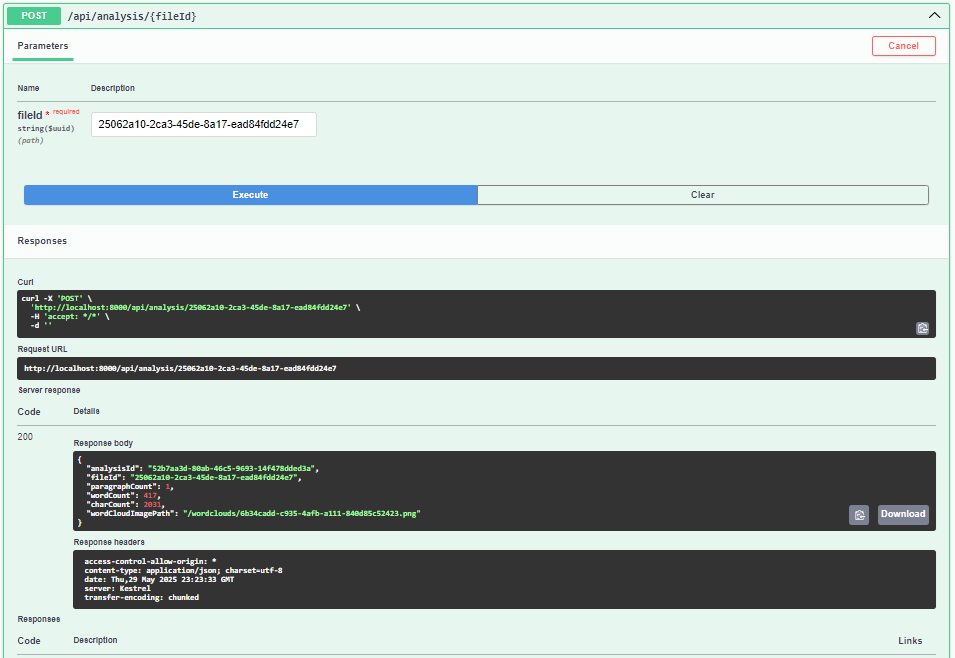
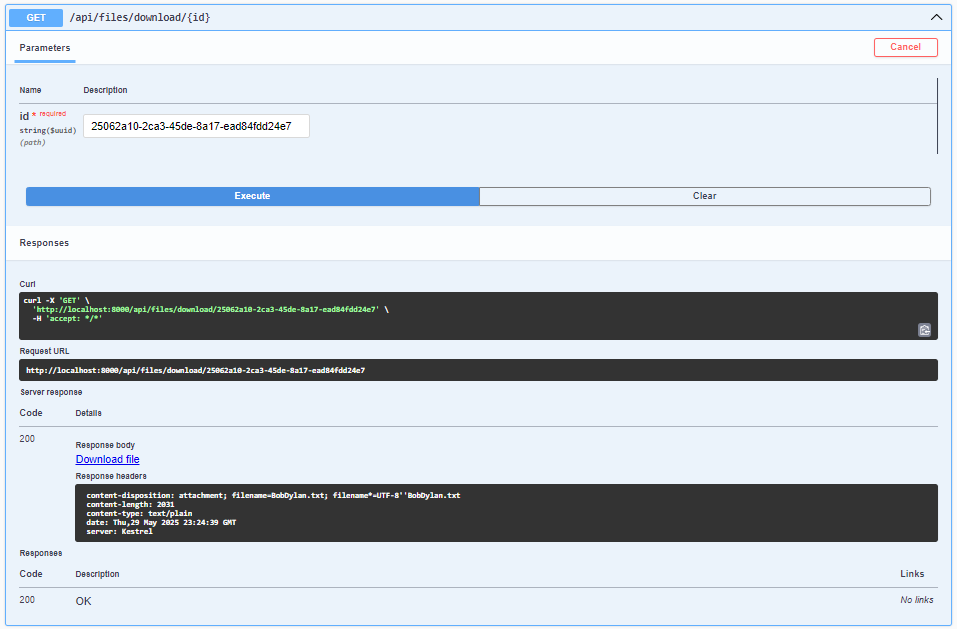
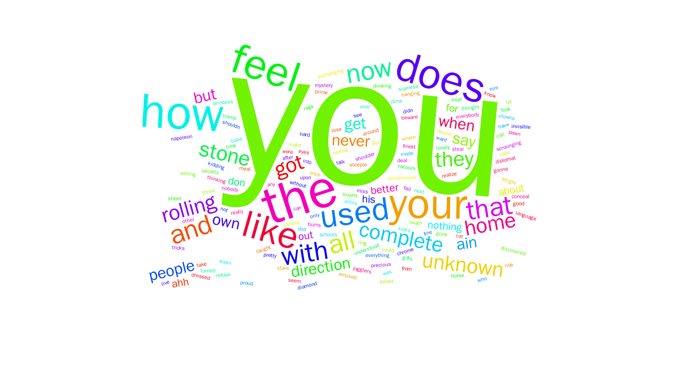
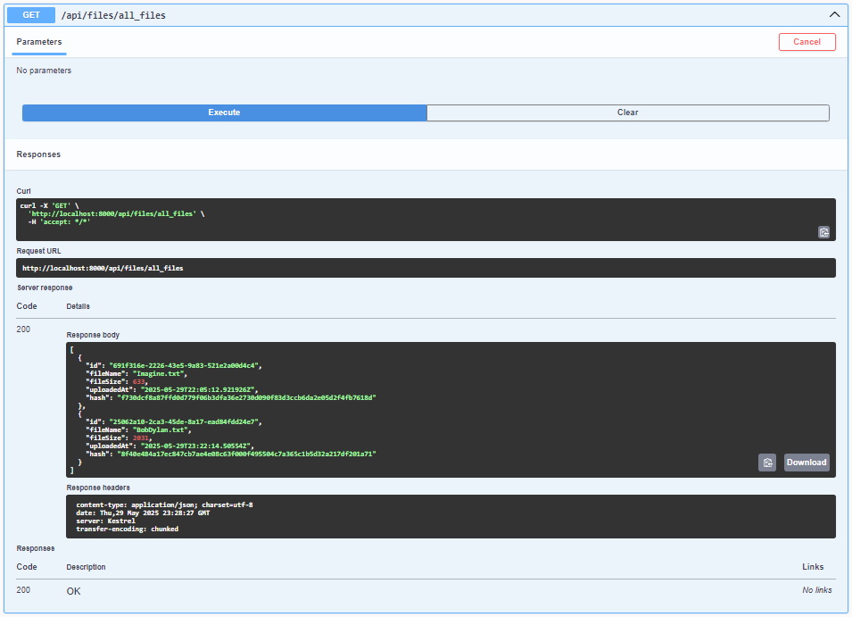
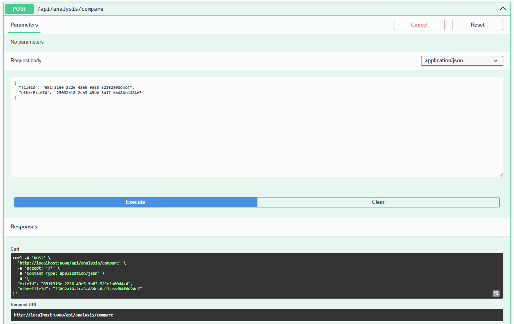
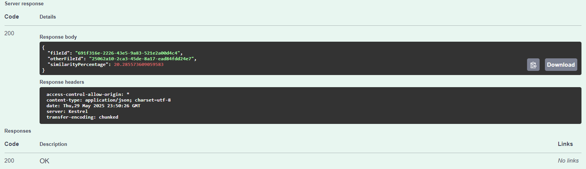
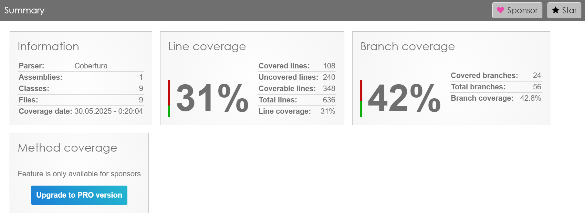
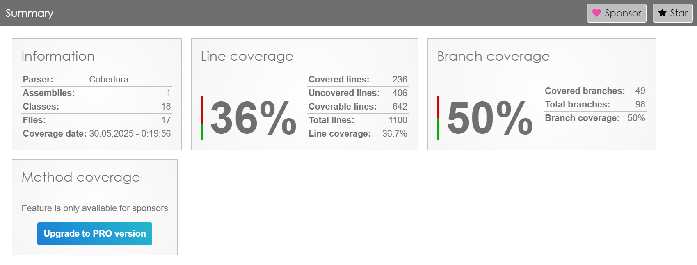

# Система анализа отчетов на плагиат

## 1. Архитектура системы

Система представляет собой веб-приложение с микросервисной архитектурой для анализа текстовых отчетов на плагиат и их статистической обработки. Состоит из следующих компонентов:

### API Gateway

-   **Назначение:** Единая точка входа для всех клиентских запросов, маршрутизация к микросервисам.
-   **Технологии:** ASP.NET Core, YARP (Yet Another Reverse Proxy), агрегация Swagger-документаций.
-   **Функции:** Перенаправляет запросы к FileStoringService и FileAnalysisService, предоставляет объединённую Swagger-документацию.

### FileStoringService

-   **Назначение:** Хранение, загрузка, выдача и удаление текстовых файлов (.txt).
-   **Технологии:** ASP.NET Core Web API, PostgreSQL (метаданные), локальное файловое хранилище.
-   **Функции:** Загрузка файлов, проверка формата, получение содержимого и метаданных, удаление файлов.

### FileAnalysisService

-   **Назначение:** Анализ текстовых файлов: статистика (абзацы, слова, символы), проверка на плагиат, генерация облака слов.
-   **Технологии:** ASP.NET Core Web API, PostgreSQL (результаты анализа), интеграция с внешним API QuickChart.
-   **Функции:** Анализ файлов, сравнение на схожесть, хранение и выдача результатов анализа, предоставление изображений облаков слов.

---

## 2. Схема взаимодействия

### Загрузка файла

-   Клиент отправляет файл (.txt) на `/api/files/upload`.
-   API Gateway перенаправляет запрос в FileStoringService.
-   FileStoringService проверяет формат файла, сохраняет файл и метаданные.
-   Возвращается уникальный идентификатор файла (FileId).

### Анализ файла

-   Клиент отправляет запрос на `/api/analysis/{fileId}`.
-   API Gateway перенаправляет запрос в FileAnalysisService.
-   FileAnalysisService запрашивает содержимое файла у FileStoringService.
-   Выполняется подсчёт статистики, проверка на плагиат и генерация облака слов.
-   Результаты сохраняются и возвращаются клиенту.

### Получение файла

-   Клиент запрашивает файл по `/api/files/download/{fileId}`.
-   API Gateway перенаправляет запрос в FileStoringService.
-   Файл возвращается клиенту.

### Получение облака слов

-   Клиент запрашивает облако слов по `/api/analysis/download_word_cloud/{fileId}`.
-   API Gateway перенаправляет запрос в FileAnalysisService.
-   Изображение облака слов возвращается клиенту.

### Получение всех файлов

-   Клиент отправляет запрос на получение списка всех файлов через API Gateway на эндпоинт `/gateway/files/all_files`.
-   API Gateway перенаправляет запрос на GET `/api/files/all_files в FileStoringService`.
-   FileStoringService извлекает метаданные всех файлов из PostgreSQL (таблица StoredFiles) и возвращает список с информацией о файлах (ID, имя файла, размер, дата загрузки, хэш) в формате JSON (HTTP 200 OK). Если файлы не найдены, возвращается 404 NotFound.

### Сравнение файлов на антиплагиат

-   Клиент отправляет запрос на сравнение двух файлов через API Gateway на эндпоинт `/gateway/analysis/compare`.
-   API Gateway перенаправляет запрос на POST `/api/analysis/compare в FileAnalysisService`.
-   FileAnalysisService запрашивает содержимое обоих файлов у FileStoringService по их идентификаторам (FileId и OtherFileId) через IFileStoringServiceClient.
-   FileAnalysisService использует IFilesPlagiarismService для сравнения содержимого файлов и вычисления процента схожести.
-   Результат сравнения (процент схожести) возвращается клиенту в формате JSON (FilePlagiarismResponceDto, HTTP 200 OK). Если один из файлов не найден, возвращается `404 NotFound`.

---

## 3. Компоненты системы

### 3.1 API Gateway

-   Технологии: ASP.NET Core, YARP, OpenApi (Swagger).
-   Конфигурация: маршруты задаются в `appsettings.json`.
-   Основные маршруты:
    -   `/gateway/files/*` → FileStoringService
    -   `/gateway/analysis/*` → FileAnalysisService
-   Особенности: агрегирует Swagger-документации, использует устойчивые HttpClient-политики, Swagger UI доступен в режиме разработки.

### 3.2 FileStoringService

-   Технологии: ASP.NET Core Web API, Entity Framework Core, PostgreSQL, локальное файловое хранилище.
-   Модель данных: хранение метаданных файлов (идентификатор, имя, размер, дата загрузки, хэш).
-   Основные возможности: загрузка, скачивание, удаление файлов, получение метаданных и содержимого.
-   Обработка ошибок: проверка формата, 404 при отсутствии файла, 500 при ошибках сервера.

### 3.3 FileAnalysisService

-   Технологии: ASP.NET Core Web API, Entity Framework Core, PostgreSQL, интеграция с FileStoringService и QuickChart API.
-   Модель данных: хранение результатов анализа (количество абзацев, слов, символов, путь к облаку слов).
-   Основные возможности: анализ файла, получение результатов, сравнение файлов, скачивание облака слов.
-   Обработка ошибок: 404 при отсутствии данных, 500 при внутренних ошибках.

---

## 4. API Спецификация

-   Документировано с использованием Swagger.
-   URL для Swagger UI:
    -   API Gateway: `http://localhost:8000/swagger`
    -   FileStoringService: `http://localhost:8001/swagger`
    -   FileAnalysisService: `http://localhost:8002/swagger`

---

## 5. Развёртывание

-   Технологии: Docker, Docker Compose.
-   В `docker-compose.yml` настроены сервисы:
    -   API Gateway (порт 8000)
    -   FileStoringService (порт 8001) с PostgreSQL
    -   FileAnalysisService (порт 8002) с PostgreSQL
-   Объемы для хранения данных и файлов.
-   Запуск: `docker-compose up --build`

---

## 6. Обработка ошибок

-   API Gateway: логирование ошибок, HttpClient с политиками retry и таймаутов.
-   FileStoringService: проверка формата файлов, обработка исключений при работе с файлами и БД.
-   FileAnalysisService: проверка наличия файла, обработка ошибок интеграции с FileStoringService и QuickChart API.

---

## 7. Тестирование

-   Юнит-тесты покрывают FileStoringService и FileAnalysisService.
-   Требуемое покрытие кода — более 65%.

